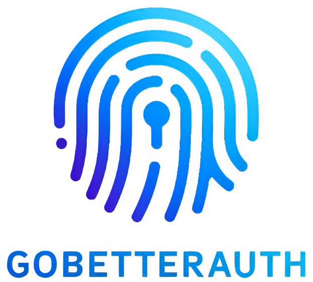

  

 A comprehensive, framework-agnostic authentication and authorization library for Go.

---

### Table of Contents

1.  [Introduction](#introduction)
1.  [Features](#features)
1.  [Docs](#docs)
1.  [Contributing](#contributing)

---

### Introduction

✨ Overview

**GoBetterAuth** is a comprehensive, authentication and authorization library/framework for Go applications. It provides secure email/password authentication, session management, email verification, password reset, and more, all built with clean architecture.

💭 Why GoBetterAuth?

**GoBetterAuth** is designed to be a comprehensive authentication and authorization solution for Go applications. It simplifies the implementation of common security features while providing a clean and modular architecture. This way developers can focus on building their applications without worrying about the complexities of authentication and the time it takes to implement these features.

---

### Features

- 🔑 **Email & Password Authentication** – Secure, production-ready authentication with argon2 password hashing
- ✉️ **Email Verification** – Configurable email verification workflow
- 🔄 **Password Reset** – Secure password reset with customisable email callbacks
- 🔄 **Change Email** – Securely change your email
- 🔐 **Session Management** – Secure, customisable session handling with refresh and expiration controls
- 🌐 **Social OAuth Providers** – Google, GitHub, Discord and more.
- 💾 **Multiple Database Support** – SQLite, PostgreSQL, MySQL adapters and more, with migration scripts included
- 📦 **Minimal Dependencies** – Standard library first, production-ready, and framework-agnostic
- 🧩 **Comprehensive Configuration** – Flexible, type-safe config with sensible defaults and environment variable support

---

### Docs

For more info and a full guide on how to use this library, check out the [Docs](https://go-better-auth.vercel.app/docs).

---

### Roadmap

Planned features:

- 🔌 **Plugin System** – Extensible plugin architecture for custom business logic and routes. Including flexible plugin interface to implement all kinds of plugins with third party providers.
- 🛡️ **Enhanced Security** – CSRF protection and more.
- ⚡ **Rate Limiting** – Configurable, per-endpoint rate limiting with memory or database storage
- 🔁 **Token Refresh Flow** – Automatic token refresh and session extension

---

### Contributing

Your contributions are welcome! Here's how you can get involved:

- If you find a bug, please [submit an issue](https://github.com/GoBetterAuth/go-better-auth/issues).
- Set up your development environment by following our [Contribution Guide](./.github/CONTRIBUTING.md).
- Contribute code by making a [pull request](https://github.com/GoBetterAuth/go-better-auth/) to enhance features, improve user experience, or fix issues.

---

### Support & Community

- [Discord Server](https://discord.gg/nThBksdr2Z)

---
